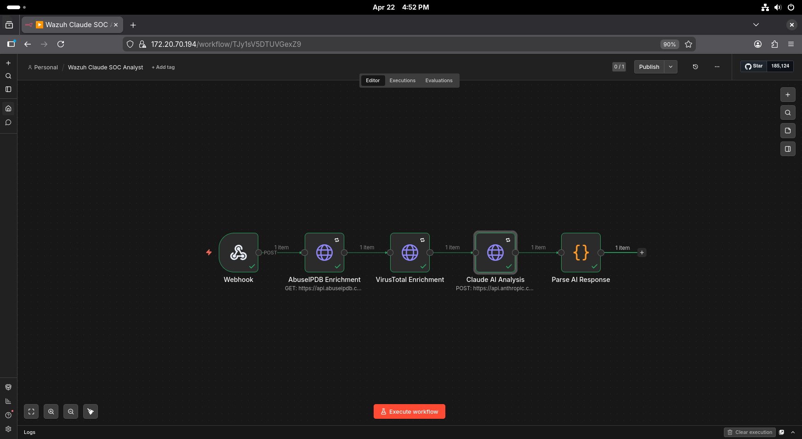
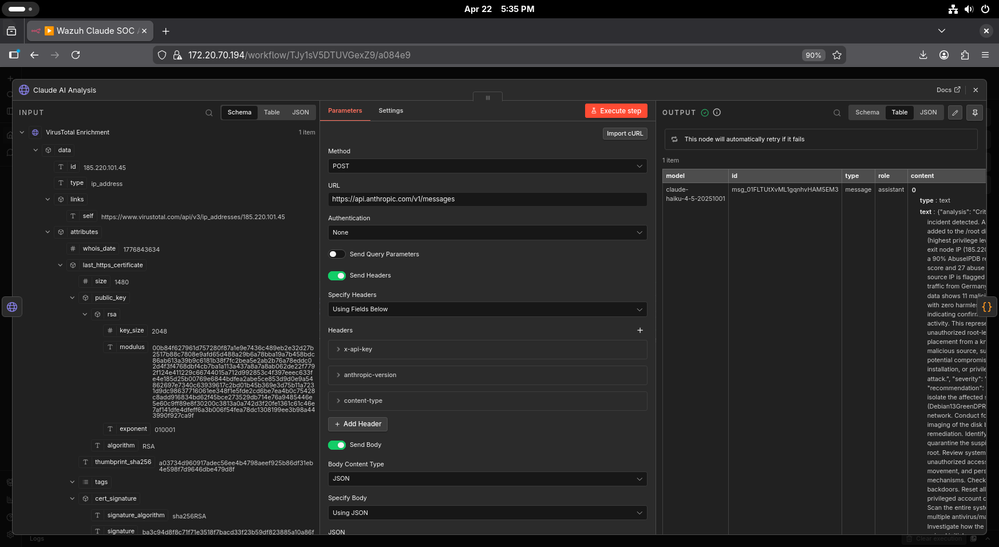
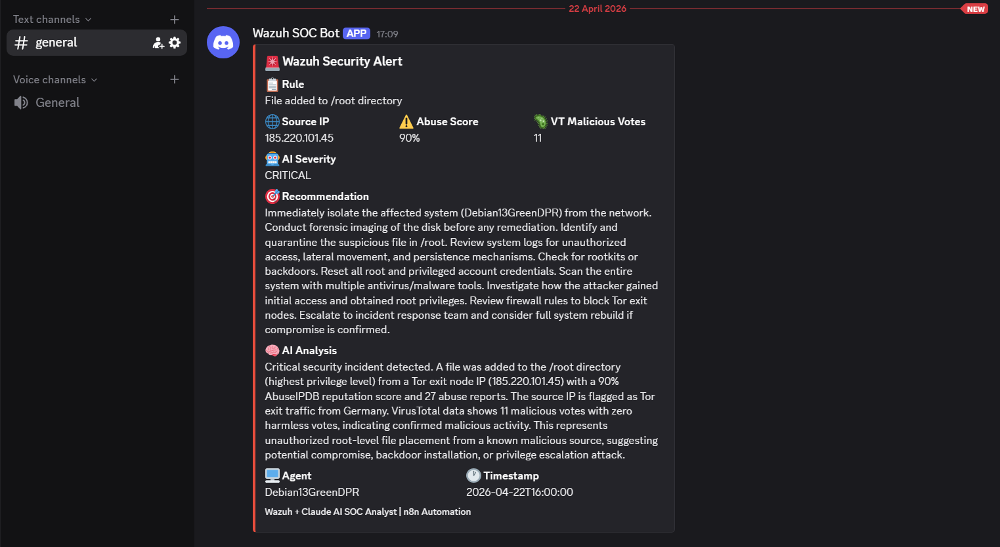

# Wazuh + Claude AI SOC Analyst

AI-powered SOC workflow: Wazuh FIM alerts → IP enrichment (AbuseIPDB + VirusTotal) → Claude AI triage analysis → Discord notification.

Built as a portfolio project expanding the [wazuh-n8n-soar](https://github.com/Ricard0D1as/wazuh-n8n-soar) lab with AI-driven alert analysis.

---

## Objective

Demonstrate an AI-augmented SOAR pipeline where Claude AI acts as a first-line SOC analyst — automatically triaging security alerts, assessing threat severity, and recommending response actions in natural language.

---

## Architecture

```
Wazuh FIM (alert) → custom-n8n.py → nginx (HTTPS/443) → n8n webhook
    → AbuseIPDB enrichment
    → VirusTotal enrichment
    → Claude AI Analysis (Haiku 4.5)
    → Threat Filter (severity != LOW)
    → Discord notification (with AI analysis)
         ↓ false branch
    → Log Ignored Alert
```

---

## Stack

| Tool | Version | Role |
|------|---------|------|
| Wazuh | 4.14.4 | SIEM / FIM / alert engine |
| n8n | 2.16.0 | SOAR / workflow automation |
| Claude Haiku | 4.5 | AI SOC analyst |
| AbuseIPDB | API v2 | IP reputation |
| VirusTotal | API v3 | IP/file malware analysis |
| nginx | alpine | Reverse proxy + TLS |
| Discord | Webhook | SOC notification channel |
| Docker | - | Container runtime |

---

## Repository Structure

    wazuh-claude-soc-analyst/
    ├── README.md
    ├── docs/
    │   ├── 01-workflow-setup.md
    │   ├── 02-claude-ai-node.md
    │   └── 03-discord-output.md
    ├── screenshots/
    │   ├── 01-installation/
    │   ├── 02-n8n-workflow/
    │   ├── 03-ai-analysis/
    │   └── 04-final-result/
    └── workflow/
        └── wazuh-claude-soc-analyst.json

---

## Prerequisites

This project extends the `wazuh-n8n-soar` pipeline. Before starting ensure you have:

- Wazuh Manager running with `custom-n8n` integration configured
- n8n running behind nginx with TLS
- AbuseIPDB API key
- VirusTotal API key
- Anthropic API key (console.anthropic.com)
- Discord server with webhook

---

## AI Analysis Output

For each alert, Claude AI generates a structured triage report:

```
AI Analysis:
This IP (185.220.101.45) is a confirmed Tor exit node with a 100%
AbuseIPDB confidence score and 11 malicious VirusTotal votes.
It has been observed conducting SSH brute-force attacks across
multiple targets as recently as April 2026.

Severity: CRITICAL
Recommendation: BLOCK immediately at firewall level and investigate
any successful connections from this IP in the last 24 hours.
```

---

## Testing

Send a test alert with a known malicious IP:

```bash
curl -k -X POST https://YOUR_N8N_IP/webhook-test/wazuh-alert \
  -H "Content-Type: application/json" \
  -d '{
    "rule_id":"100201",
    "rule_desc":"File added to /root directory",
    "level":7,
    "src_ip":"185.220.101.45",
    "agent_name":"Debian13GreenDPR",
    "timestamp":"2026-04-15T10:00:00"
  }'
```

---

## 📸 Screenshots

### n8n Workflow Canvas


### Claude AI Analysis Output


### Discord Alert with AI Analysis


---

## Documentation

- [01 — Workflow Setup](docs/01-workflow-setup.md)
- [02 — Claude AI Node](docs/02-claude-ai-node.md)
- [03 — Discord Output](docs/03-discord-output.md)

---

## Cost Estimate

Using Claude Haiku 4.5 (~$0.0004 per alert analysis):

| Usage | Estimated Cost |
|-------|---------------|
| 100 alerts | ~$0.04 |
| 1,000 alerts | ~$0.40 |
| 10,000 alerts | ~$4.00 |

The $5 free Anthropic API credits cover approximately 12,000 alert analyses.

---

## Security Notes

- API keys stored in n8n credentials — never commit them to GitHub
- Self-signed TLS certificate — replace with proper cert in production
- Claude AI analysis is advisory only — human review required for critical actions

---

## Related Projects

- [wazuh-n8n-soar](https://github.com/Ricard0D1as/wazuh-n8n-soar) — Base SOAR pipeline this project extends

---

## 📄 License

MIT © Ricardo Dias
